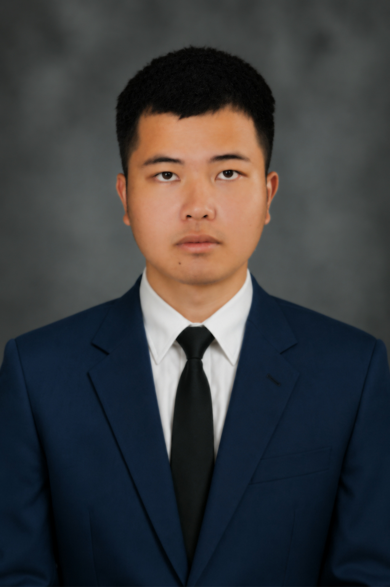

<h4>🎤 Interview By</h4>
<h1>... | ...</h1>

👤 <b>Name:</b> Ratthakit Wiangsanthia  
✨ <b>Nickname:</b> Sense  
💻 <b><a href="https://www.instagram.com/rathkity?igsh=Zm91NzgxeXZ4M3B2">Instagram</a></b>

 

  

 

<h1>💭 What kind of person are you, and why?</h1>

I am not very good at socializing, and I sometimes find it difficult to talk with others. 👥💬

<h1>💻 What do you like to do in your free time, and why?</h1>

I like playing games and watching movies and series because they help me relax. 🎮🎬

<h1>🚀 What is the most important thing in your life, and why?</h1>

My family, without a doubt. They always support me and stay by my side. 🏡💖

<h1>🎯 What experience has had the biggest impact on who you are today?</h1>

Joining an English-only Hackathon had the biggest impact on me, even though I could barely speak English. 🏆

<h1>💪 What do you think a good business should have, and why?</h1>

A good business should have a strong leader and CEO because good leadership helps the business succeed. 👔🚀
