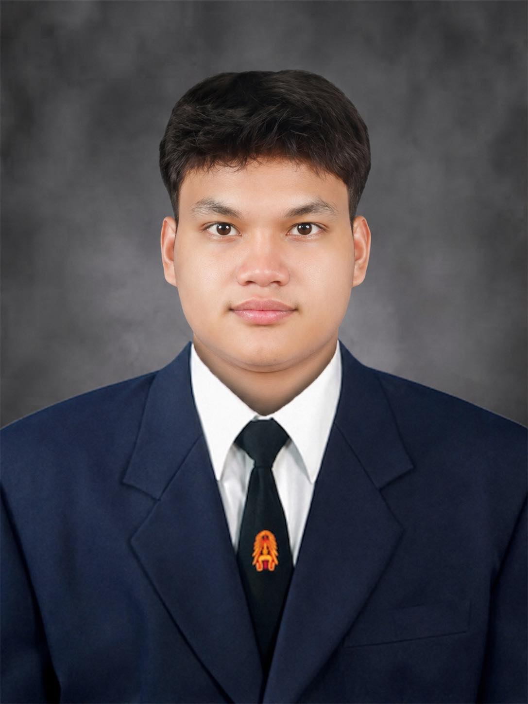

<h1>
<strong>Interview by Natthawat Rodchanathanatham 69130500020</strong>
</h1>

  
   

  <h2><a href="https://github.com/decemberlnwza007">GitHub: decemberlnwza007</a><h/2>

<h1>1. What kind of person are you, and why? 😊💪</h1>
- I am a friendly and hardworking person. I like learning new things 📚 and challenging myself 🎯 because I always want to improve and become better. 🚀

<h1>2. What do you like to do in your free time, and why? 🎮⚽💻</h1>
- In my free time, I like playing games 🎮, watching football ⚽, and learning about technology and programming 💻. These activities help me relax 😌 and also give me new ideas. 💡

<h1>3. What kind of business would you like to start, and why? 💻🚀</h1>
I would like to start a technology or software business. 🧑‍💻 I enjoy programming and creating useful applications 📱, so I want to use my skills to solve real problems 🛠️ and build something of my own. 🌟

<h1>4. What are your goals for the future, and why? 🎯🏆</h1>
My goals are to become a successful software engineer 👨‍💻, gain more experience 📈, and have a stable career. 💼 I also want to keep improving my skills because technology is always changing. 🌐🚀

<h1>5. What is your greatest strength, and why? 💪🔥</h1>
My greatest strength is that I am willing to learn 📚 and never give up easily. 💪 When I face a difficult problem 🧩, I try to find a solution 💡 and learn from my mistakes. 🌱
