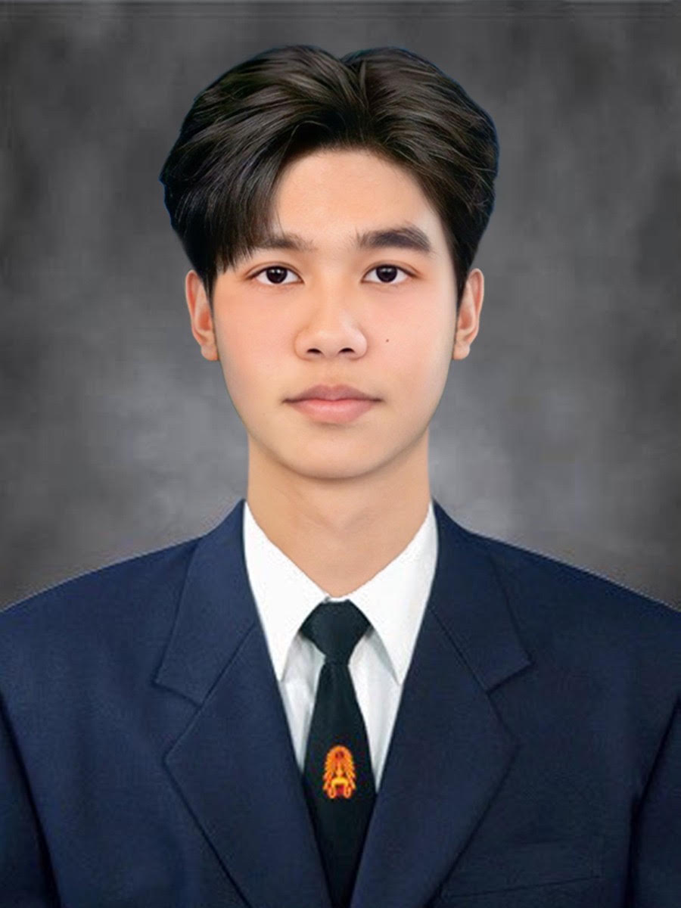

  ## **
<strong>Interview by Natthawat Rodchanathanatham 69130500020</strong>
</h1>**

  
    
  <a href="https://github.com/decemberlnwza007">
    <strong>GitHub: decemberlnwza007</strong>
  </a>

  

  

  ## ***1. What kind of person are you, and why? 😊💪***
  - ### I am a friendly and hardworking person. I like learning new things 📚 and challenging myself 🎯 because I always want to improve and become better. 🚀

  ## ***2. What do you like to do in your free time, and why? 🎮⚽💻***
  - ### In my free time, I like playing games 🎮, watching football ⚽, and learning about technology and programming 💻. These activities help me relax 😌 and also give me new ideas. 💡

  ## ***3. What kind of business would you like to start, and why? 💻🚀***
  - ### I would like to start a technology or software business. 🧑‍💻 I enjoy programming and creating useful applications 📱, so I want to use my skills to solve real problems 🛠️ and build something of my own. 🌟

  ## ***4. What are your goals for the future, and why? 🎯🏆***
  - ### My goals are to become a successful software engineer 👨‍💻, gain more experience 📈, and have a stable career. 💼 I also want to keep improving my skills because technology is always changing. 🌐🚀

  ## ***5. What is your greatest strength, and why? 💪🔥***
  - ### My greatest strength is that I am willing to learn 📚 and never give up easily. 💪 When I face a difficult problem 🧩, I try to find a solution 💡 and learn from my mistakes. 🌱

<h4>🎤 Interview By</h4>
<h1>Natthawat Rodchanathanatham | 69130500020</h1>

👤 <b>Name:</b> Natthawat Rodchanathanatham  
✨ <b>Nickname:</b> Tam  
💻 <b><a href="https://www.instagram.com/tam.ntw/">Instagram</a></b>

 

  

 

<h1>💭 What kind of person are you, and why?</h1>

I am a hardworking, curious, and responsible person. I enjoy learning new things, especially about technology, cybersecurity, and software development. When I have a goal, I try my best to achieve it and I am not afraid of challenging myself. 🚀

<h1>💻 What do you like to do in your free time, and why?</h1>

In my free time, I like practicing cybersecurity, joining CTF competitions, programming, and exploring new technologies. I enjoy these activities because they help me improve my technical skills and allow me to learn from real-world problems. 🧠

<h1>🚀 What kind of business would you like to start, and why?</h1>

I would like to start a technology business that develops software and AI solutions. I am interested in creating applications that can solve real problems and make people's lives easier. I believe technology and AI have a lot of potential to create useful products and new opportunities. 🤖

<h1>🎯 What are your goals for the future, and why?</h1>

My goal is to become a skilled technology professional with strong knowledge of software development, cybersecurity, cloud computing, and AI. I also want to gain experience from real projects and competitions. In the future, I would like to create my own technology products or business and use my skills to solve problems in society. 🌎

<h1>💪 What is your greatest strength, and why?</h1>

My greatest strength is that I am willing to learn and improve myself. When I face something I do not understand, I try to research, practice, and find a solution instead of giving up. I also work well with others and believe that good communication and teamwork are important for achieving a goal. 🤝
