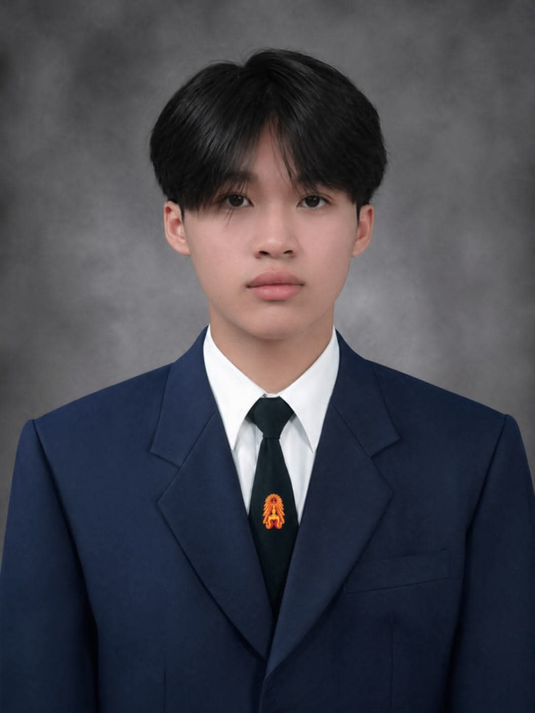

<h4>🎤 Interview By</h4>
    <h1>Phongsakon Thongrak | 69130500037</h1>

👤 <b>Name:</b> Natthawat Rodchanathanatham  
✨ <b>Nickname:</b> Tam  
💻 <b><a href="https://www.instagram.com/tam.ntw/">Instagram</a></b>

<h1 style="border: solid; padding: 5px; margin: 5px; border-radius: 10px; background-color: white; color: black;">
💭 What kind of person are you, and why?
</h1>

 

I am a hardworking, curious, and responsible person. I enjoy learning new things, especially about technology, cybersecurity, and software development. When I have a goal, I try my best to achieve it and I am not afraid of challenging myself. 🚀

<h1 style="border: solid; padding: 5px; margin: 5px; border-radius: 10px; background-color: white; color: black;">
💻 What do you like to do in your free time, and why?
</h1>

 

In my free time, I like practicing cybersecurity, joining CTF competitions, programming, and exploring new technologies. I enjoy these activities because they help me improve my technical skills and allow me to learn from real-world problems. 🧠

<h1 style="border: solid; padding: 5px; margin: 5px; border-radius: 10px; background-color: white; color: black;">
🚀 What kind of business would you like to start, and why?
</h1>

 

I would like to start a technology business that develops software and AI solutions. I am interested in creating applications that can solve real problems and make people's lives easier. I believe technology and AI have a lot of potential to create useful products and new opportunities. 🤖

<h1 style="border: solid; padding: 5px; margin: 5px; border-radius: 10px; background-color: white; color: black;">
🎯 What are your goals for the future, and why?
</h1>

 

My goal is to become a skilled technology professional with strong knowledge of software development, cybersecurity, cloud computing, and AI. I also want to gain experience from real projects and competitions. In the future, I would like to create my own technology products or business and use my skills to solve problems in society. 🌎

<h1 style="border: solid; padding: 5px; margin: 5px; border-radius: 10px; background-color: white; color: black;">
💪 What is your greatest strength, and why?
</h1>

 

My greatest strength is that I am willing to learn and improve myself. When I face something I do not understand, I try to research, practice, and find a solution instead of giving up. I also work well with others and believe that good communication and teamwork are important for achieving a goal. 🤝